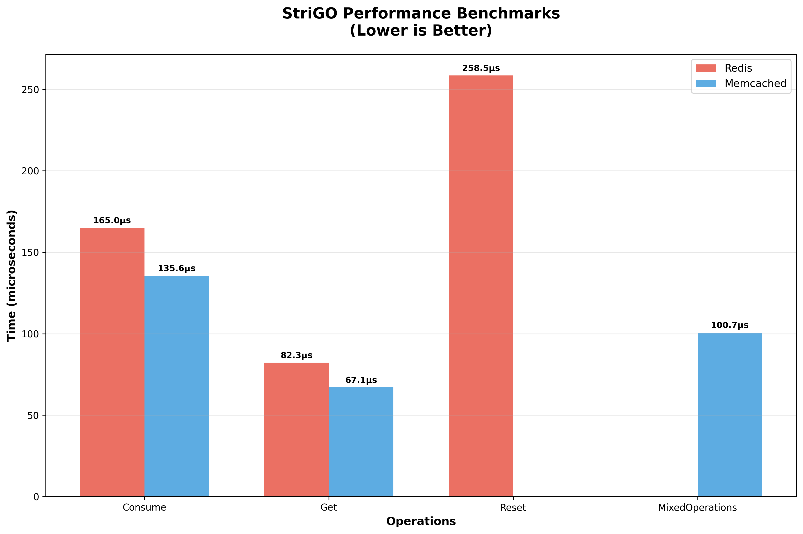
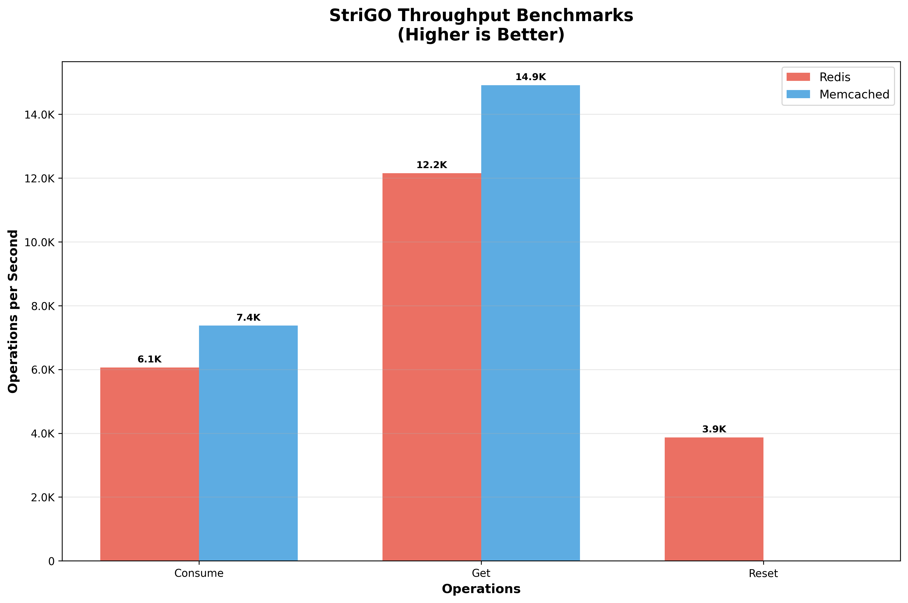

# StriGO 🚀

[](https://go.dev/)
[](https://github.com/veyselaksin/strigo/releases)
[](LICENSE)
[](https://github.com/veyselaksin/strigo/actions)
[](https://goreportcard.com/report/github.com/veyselaksin/strigo)
[](https://github.com/veyselaksin/strigo/tree/main/docker)

StriGO is a comprehensive and flexible rate limiter for Go applications, inspired by the popular Node.js package [`rate-limiter-flexible`](https://www.npmjs.com/package/rate-limiter-flexible). ⚡️

## ✨ Features

- 🚀 **Simple API** - Easy to use, minimal configuration required
- 🔄 **Multiple Strategies** - Token Bucket, Leaky Bucket, Fixed Window, Sliding Window (correctly implemented)
- 🗄️ **Flexible Storage** - Redis, Memcached, or in-memory storage
- 📊 **Detailed Results** - Rich information about rate limit status
- 🎯 **Point-based System** - Consume different amounts of points per operation
- ⚡ **High Performance** - Optimized for speed and efficiency
- 🌐 **Framework Agnostic** - Works with any Go web framework
- 📁 **Modular Design** - Clean separation of concerns like rate-limiter-flexible

## 🚀 Quick Start

### 📋 Prerequisites

- 🔧 Go 1.22.3 or later
- 🐳 Docker and Docker Compose
- 📦 Redis
- 💾 Memcached

### 📥 Installation

```bash
go get github.com/veyselaksin/strigo/v2@v2.0.0
```

## 💡 Basic Usage

### Simple Memory-based Rate Limiting

```go
package main

import (
    "fmt"
    "log"

    "github.com/veyselaksin/strigo/v2"
)

func main() {
    // Create rate limiter - 5 requests per 10 seconds using Token Bucket (default)
    opts := &strigo.Options{
        Points:   5,  // 5 requests
        Duration: 10, // per 10 seconds
        Strategy: strigo.TokenBucket, // Classic token bucket with gradual refill
    }

    limiter, err := strigo.New(opts)
    if err != nil {
        log.Fatal(err)
    }
    defer limiter.Close()

    // Check rate limit
    key := "user:123"
    result, err := limiter.Consume(key, 1) // Consume 1 point
    if err != nil {
        log.Fatal(err)
    }

    if result.Allowed {
        fmt.Printf("✅ Request allowed! Remaining: %d\n", result.RemainingPoints)
    } else {
        fmt.Printf("❌ Rate limited! Try again in %dms\n", result.MsBeforeNext)
    }
}
```

### Different Rate Limiting Strategies

```go
// Token Bucket - Allows bursts, gradual token refill
tokenLimiter, _ := strigo.New(&strigo.Options{
    Points:   10,
    Duration: 60,
    Strategy: strigo.TokenBucket, // Tokens refill continuously over time
})

// Leaky Bucket - Smooth request processing, constant drain rate
leakyLimiter, _ := strigo.New(&strigo.Options{
    Points:   10,
    Duration: 60,
    Strategy: strigo.LeakyBucket, // Requests queue and drain at fixed rate
})

// Sliding Window - Precise time-based limiting
slidingLimiter, _ := strigo.New(&strigo.Options{
    Points:   10,
    Duration: 60,
    Strategy: strigo.SlidingWindow, // Tracks individual request timestamps
})

// Fixed Window - Simple counter reset at intervals
fixedLimiter, _ := strigo.New(&strigo.Options{
    Points:   10,
    Duration: 60,
    Strategy: strigo.FixedWindow, // Counter resets every minute
})
```

### Redis-based Rate Limiting

```go
import (
    "github.com/redis/go-redis/v9"
    "github.com/veyselaksin/strigo/v2"
)

func main() {
    // Create Redis client
    redisClient := redis.NewClient(&redis.Options{
        Addr: "localhost:6379",
    })

    // Create rate limiter with Redis storage
    opts := &strigo.Options{
        Points:      100, // 100 requests
        Duration:    60,  // per minute
        Strategy:    strigo.TokenBucket, // Use token bucket algorithm
        StoreClient: redisClient,
        KeyPrefix:   "myapp",
    }

    limiter, err := strigo.New(opts)
    if err != nil {
        log.Fatal(err)
    }
    defer limiter.Close()

    result, err := limiter.Consume("api:user456", 1)
    // Handle result...
}
```

### Variable Point Consumption

```go
// Different operations consume different amounts of points
limiter, _ := strigo.New(&strigo.Options{
    Points:   100, // 100 points total
    Duration: 60,  // per minute
    Strategy: strigo.TokenBucket, // Allows for burst consumption
})

operations := map[string]int64{
    "view_profile":    1,  // Light operation
    "update_profile":  5,  // Medium operation
    "upload_file":     10, // Heavy operation
    "generate_report": 25, // Very heavy operation
}

for operation, cost := range operations {
    result, err := limiter.Consume("user:123", cost)
    if result.Allowed {
        fmt.Printf("✅ %s allowed (cost: %d, remaining: %d)\n",
            operation, cost, result.RemainingPoints)
    } else {
        fmt.Printf("❌ %s blocked - rate limit exceeded\n", operation)
    }
}
```

## 🏗️ Recommended Project Structure

For clean and maintainable code, we recommend organizing your rate limiters similar to the popular Node.js rate-limiter-flexible pattern:

### `limiter.go` - Define your rate limiters

```go
package main

import (
    "log"
    "github.com/redis/go-redis/v9"
    "github.com/veyselaksin/strigo/v2"
)

var (
    // Global rate limiter instances
    ApiLimiter     *strigo.RateLimiter
    AuthLimiter    *strigo.RateLimiter
    UploadLimiter  *strigo.RateLimiter
    PremiumLimiter *strigo.RateLimiter
)

// InitializeLimiters sets up all rate limiters
func InitializeLimiters() {
    redisClient := redis.NewClient(&redis.Options{
        Addr: "localhost:6379",
    })

    // API Rate Limiter - 100 requests per minute
    var err error
    ApiLimiter, err = strigo.New(&strigo.Options{
        Points:      100,
        Duration:    60,
        KeyPrefix:   "api",
        StoreClient: redisClient,
    })
    if err != nil {
        log.Printf("⚠️  Redis not available, using memory for API limiter: %v", err)
        ApiLimiter, _ = strigo.New(&strigo.Options{
            Points:    100,
            Duration:  60,
            KeyPrefix: "api",
        })
    }

    // Auth Rate Limiter - 5 login attempts per 5 minutes
    AuthLimiter, err = strigo.New(&strigo.Options{
        Points:      5,
        Duration:    300,
        KeyPrefix:   "auth",
        StoreClient: redisClient,
    })
    if err != nil {
        log.Printf("⚠️  Redis not available, using memory for auth limiter: %v", err)
        AuthLimiter, _ = strigo.New(&strigo.Options{
            Points:    5,
            Duration:  300,
            KeyPrefix: "auth",
        })
    }

    // Upload Rate Limiter - 10 uploads per hour
    UploadLimiter, err = strigo.New(&strigo.Options{
        Points:      10,
        Duration:    3600,
        KeyPrefix:   "upload",
        StoreClient: redisClient,
    })
    if err != nil {
        log.Printf("⚠️  Redis not available, using memory for upload limiter: %v", err)
        UploadLimiter, _ = strigo.New(&strigo.Options{
            Points:    10,
            Duration:  3600,
            KeyPrefix: "upload",
        })
    }

    log.Println("✅ Rate limiters initialized successfully")
}
```

### `middleware.go` - Create reusable middleware

```go
package main

import (
    "strconv"
    "time"
    "github.com/gofiber/fiber/v2"
    "github.com/veyselaksin/strigo/v2"
)

// Rate limiting middleware
func rateLimitMiddleware(limiter *strigo.RateLimiter, points ...int64) fiber.Handler {
    return func(c *fiber.Ctx) error {
        // Generate user key (IP, User ID, API key, etc.)
        key := getUserKey(c)

        // Use default points value if none provided
        consumePoints := int64(1)
        if len(points) > 0 {
            consumePoints = points[0]
        }

        // Consume points from the rate limiter
        result, err := limiter.Consume(key, consumePoints)
        if err != nil {
            return c.Status(500).JSON(fiber.Map{
                "error": "Rate limiter error",
            })
        }

        // Add standard rate limit headers
        headers := result.Headers()
        for name, value := range headers {
            c.Set(name, value)
        }

        // Check if request is allowed
        if !result.Allowed {
            return c.Status(429).JSON(fiber.Map{
                "error":             "Rate limit exceeded",
                "retryAfterSeconds": result.MsBeforeNext / 1000,
                "retryAfterMs":      result.MsBeforeNext,
                "limit":             result.TotalHits,
                "consumed":          result.ConsumedPoints,
                "remaining":         result.RemainingPoints,
                "resetTime":         time.Now().Add(time.Duration(result.MsBeforeNext) * time.Millisecond).Unix(),
            })
        }

        // Add rate limit info to response headers for successful requests
        c.Set("X-RateLimit-Points-Consumed", strconv.FormatInt(consumePoints, 10))

        return c.Next()
    }
}

// Generate user key for rate limiting
func getUserKey(c *fiber.Ctx) string {
    // In a real application, you might use:
    // - User ID from JWT token
    // - API key
    // - Combination of IP + User-Agent

    userID := c.Get("X-User-ID")
    if userID != "" {
        return "user:" + userID
    }

    return "ip:" + c.IP()
}
```

### `main.go` - Use in your application

```go
package main

import (
    "log"
    "github.com/gofiber/fiber/v2"
)

func main() {
    app := fiber.New()

    // Initialize rate limiters
    InitializeLimiters()

    // Standard API endpoints
    api := app.Group("/api")
    api.Get("/users", rateLimitMiddleware(ApiLimiter), getUsersHandler)
    api.Get("/premium", rateLimitMiddleware(PremiumLimiter, 1), getPremiumHandler)

    // Expensive operations (consume more points)
    api.Get("/analytics", rateLimitMiddleware(ApiLimiter, 5), getAnalyticsHandler)
    api.Get("/export", rateLimitMiddleware(ApiLimiter, 10), getExportHandler)

    // Authentication endpoints
    auth := app.Group("/auth")
    auth.Post("/login", rateLimitMiddleware(AuthLimiter, 1), loginHandler)

    // File upload endpoints
    app.Post("/upload", rateLimitMiddleware(UploadLimiter, 1), uploadHandler)

    log.Fatal(app.Listen(":3000"))
}

// Handler functions
func getUsersHandler(c *fiber.Ctx) error {
    return c.JSON(fiber.Map{"users": []string{"user1", "user2"}})
}

func getPremiumHandler(c *fiber.Ctx) error {
    return c.JSON(fiber.Map{"premium": "data"})
}

func getAnalyticsHandler(c *fiber.Ctx) error {
    return c.JSON(fiber.Map{"analytics": "expensive operation"})
}

func loginHandler(c *fiber.Ctx) error {
    return c.JSON(fiber.Map{"token": "jwt-token"})
}

func uploadHandler(c *fiber.Ctx) error {
    return c.JSON(fiber.Map{"uploaded": true})
}
```

This structure provides:

- ✅ **Clean separation of concerns**
- ✅ **Easy to test and maintain**
- ✅ **Reusable middleware**
- ✅ **Global rate limiter instances**
- ✅ **Consistent with rate-limiter-flexible patterns**

## 🎛️ Configuration Options

```go
type Options struct {
    // Points defines the maximum number of points that can be consumed over duration
    Points int64

    // Duration defines the time window for point consumption in seconds
    Duration int64

    // Strategy defines the rate limiting algorithm
    // Options: TokenBucket, LeakyBucket, FixedWindow, SlidingWindow
    Strategy Strategy

    // BlockDuration defines how long to block key after limit exceeded (seconds)
    BlockDuration int64

    // KeyPrefix is used to create unique keys in the storage backend
    KeyPrefix string

    // StoreClient is the Redis/Memcached client instance
    // If nil, uses in-memory storage
    StoreClient interface{}

    // StoreType specifies the type of store client ("redis", "memcached", "memory")
    StoreType string
}
```

## 📊 Result Information

The `Consume` method returns a detailed `Result` object:

```go
type Result struct {
    MsBeforeNext      int64 // Milliseconds before next action can be done
    RemainingPoints   int64 // Number of remaining points in current duration
    ConsumedPoints    int64 // Number of consumed points in current duration
    IsFirstInDuration bool  // Whether the action is first in current duration
    TotalHits         int64 // Total points allowed in the duration
    Allowed           bool  // Whether the request was allowed
}

// Get standard HTTP headers
headers := result.Headers()
// Returns: X-RateLimit-Limit, X-RateLimit-Remaining, X-RateLimit-Reset, Retry-After
```

## 🔧 Advanced Usage

### Multiple Rate Limiters

```go
// API rate limiter - 1000 requests per hour
apiLimiter, _ := strigo.New(&strigo.Options{Points: 1000, Duration: 3600})

// Auth rate limiter - 5 attempts per 5 minutes
authLimiter, _ := strigo.New(&strigo.Options{Points: 5, Duration: 300})

// File upload - 10 uploads per hour
uploadLimiter, _ := strigo.New(&strigo.Options{Points: 10, Duration: 3600})
```

### Check Status Without Consuming

```go
// Get current rate limit status without consuming points
result, err := limiter.Get("user:123")
if result != nil {
    fmt.Printf("Current usage: %d/%d\n", result.ConsumedPoints, result.TotalHits)
}
```

### Manual Blocking

```go
// Block a key for 300 seconds
err := limiter.Block("user:123", 300)
```

### Reset Rate Limit

```go
// Reset rate limit for a key
err := limiter.Reset("user:123")
```

## 🏗️ Rate Limiting Strategies

StriGO implements four distinct rate limiting algorithms, each with different characteristics and use cases:

### **🪣 Token Bucket** (Default)

- **Algorithm**: Gradual token refill with burst capability
- **Behavior**: Tokens are continuously added to the bucket at a fixed rate. Requests consume tokens. Allows bursts up to bucket capacity.
- **Use Case**: APIs that need to allow occasional bursts while maintaining average rate
- **Technical**: Stores current tokens, last refill time, and refill rate. Tokens refill continuously based on elapsed time.

```go
limiter, _ := strigo.New(&strigo.Options{
    Points:   10,        // 10 tokens capacity
    Duration: 60,        // Refill 10 tokens per 60 seconds
    Strategy: strigo.TokenBucket,
})
// Allows immediate burst of 10 requests, then 1 request every 6 seconds
```

### **💧 Leaky Bucket**

- **Algorithm**: Constant drain rate with request queueing
- **Behavior**: Requests are added to a queue and processed at a constant rate. Smooths out traffic spikes.
- **Use Case**: Services requiring smooth, predictable traffic flow
- **Technical**: Maintains a queue of pending requests that drain at a fixed rate regardless of arrival pattern.

```go
limiter, _ := strigo.New(&strigo.Options{
    Points:   5,         // Queue capacity of 5 requests
    Duration: 30,        // Process 5 requests per 30 seconds
    Strategy: strigo.LeakyBucket,
})
// Processes exactly 1 request every 6 seconds, queues excess requests
```

### **🕰️ Sliding Window**

- **Algorithm**: Precise timestamp tracking within rolling window
- **Behavior**: Tracks exact timestamps of each request. Window slides continuously with time.
- **Use Case**: When precise rate limiting is required without window boundary effects
- **Technical**: Stores array of request timestamps, removes expired entries on each check.

```go
limiter, _ := strigo.New(&strigo.Options{
    Points:   100,       // 100 requests
    Duration: 3600,      // per hour (3600 seconds)
    Strategy: strigo.SlidingWindow,
})
// Exactly 100 requests per any 60-minute period, sliding continuously
```

### **📊 Fixed Window**

- **Algorithm**: Counter reset at fixed intervals
- **Behavior**: Simple counter that resets completely at regular intervals.
- **Use Case**: Simple rate limiting with clear reset boundaries
- **Technical**: Single counter with TTL, resets to zero at interval boundaries.

```go
limiter, _ := strigo.New(&strigo.Options{
    Points:   1000,      // 1000 requests
    Duration: 3600,      // per hour
    Strategy: strigo.FixedWindow,
})
// 1000 requests per hour, counter resets at top of each hour
```

### **📈 Strategy Comparison**

| Strategy           | Burst Handling       | Traffic Smoothing | Memory Usage | Precision | Reset Behavior     |
| ------------------ | -------------------- | ----------------- | ------------ | --------- | ------------------ |
| **Token Bucket**   | ✅ Allows bursts     | ⚠️ Moderate       | Low          | High      | Continuous refill  |
| **Leaky Bucket**   | ❌ Queues excess     | ✅ Excellent      | Medium       | High      | Constant drainage  |
| **Sliding Window** | ⚠️ Depends on window | ⚠️ Moderate       | High         | Excellent | Continuous sliding |
| **Fixed Window**   | ✅ At window start   | ❌ Poor           | Very Low     | Low       | Periodic reset     |

## 🗄️ Storage Backends

- **Memory**: Built-in in-memory storage (default)
- **Redis**: Distributed rate limiting with Redis
- **Memcached**: Distributed rate limiting with Memcached

## 🚀 Examples

Check out the [examples](./examples/) directory for comprehensive usage patterns:

- **[Web Integration](./examples/web/) - Recommended** - Fiber web framework integration with multiple backends
- [Basic Usage](./examples/basic/) - Simple rate limiting examples and standalone usage

### Quick Example Test

```bash
# Start the web example
cd examples/web
go run main.go

# Test rate limiting in another terminal
for i in {1..6}; do curl http://localhost:3000/redis; echo; done
```

## 🧪 Testing

The project includes comprehensive test suites:

### Test Structure

```
tests/
├── redis/          # Redis backend tests
│   ├── basic_test.go       # Basic operations
│   ├── performance_test.go # Performance benchmarks
│   └── edge_cases_test.go  # Edge cases and limits
├── memcached/      # Memcached backend tests
│   ├── basic_test.go       # Basic operations
│   ├── performance_test.go # Performance benchmarks
│   └── edge_cases_test.go  # Edge cases and limits
└── helpers/        # Test utilities and helpers
```

### Running Tests

```bash
# Run all tests
go test ./tests/... -v

# Run specific backend tests
go test ./tests/redis/... -v
go test ./tests/memcached/... -v

# Run performance benchmarks
go test ./tests/redis/performance_test.go -bench=. -v
go test ./tests/memcached/performance_test.go -bench=. -v
```

### Docker Testing

Test with Docker for isolated environments:

```bash
# Build test image
cd docker
docker build -t strigo-tests -f Dockerfile.test ..

# Run tests with Docker (requires Redis and Memcached running)
docker run --rm --network host \
    -e REDIS_HOST=localhost \
    -e MEMCACHED_HOST=localhost \
    strigo-tests go test ./tests/... -v
```

### Test Coverage

The test suite includes:

- ✅ **Basic Operations**: Set, get, delete, expiration
- ✅ **Performance Tests**: Sequential and concurrent requests (100K+ req/s)
- ✅ **Edge Cases**: Large keys, special characters, extreme values
- ✅ **Connection Handling**: Failure scenarios and recovery
- ✅ **Memory Testing**: Large datasets (10K+ keys)
- ✅ **Variable Point Consumption**: Different costs per operation
- ✅ **Concurrent Safety**: High-concurrency scenarios

### Performance Benchmarks

StriGO v2.0.0 delivers exceptional performance across all storage backends:

#### 📊 Benchmark Charts


_Performance comparison showing operation latency in microseconds (lower is better)_


_Throughput comparison showing operations per second (higher is better)_

#### 🚀 Performance Results

**Redis Performance:**

- **Concurrent**: 109,156 req/s ⚡️
- **Sequential**: 11,682 req/s
- **Variable Points**: 12,148 op/s
- **Memory Usage**: 12,095 req/s (10K keys)

**Memcached Performance:**

- **Concurrent**: 89,446 req/s ⚡️
- **Sequential**: 11,773 req/s
- **Variable Points**: 11,421 op/s
- **Burst**: 11,551 req/s
- **Get Status**: 22,608 gets/s

**Test Environment:**

- **OS:** macOS (Darwin) on Apple M3
- **Go:** 1.22.3
- **Storage:** Local Redis & Memcached instances

#### 🔧 Generate Your Own Benchmarks

```bash
# Run automated benchmarks and generate charts
./benchmarks/run_benchmarks.sh

# Manual benchmark run
go test ./tests/redis/performance_test.go -bench=. -v
go test ./tests/memcached/performance_test.go -bench=. -v

# Docker performance testing
cd docker
docker build -t strigo-tests -f Dockerfile.test ..
docker run --rm --network host strigo-tests go test ./tests/... -bench=. -v
```

> 💡 **Note:** These benchmarks demonstrate single-operation latency. Concurrent performance is significantly higher due to Go's excellent goroutine handling and StriGO's optimized architecture.

## 📚 Documentation

For detailed documentation, please visit our [Documentation](https://veyselaksin.github.io/strigo/).

## 🤝 Contributing

Contributions are welcome! Please read our [Contributing Guide](CONTRIBUTING.md).

## 📄 License

This project is licensed under the MIT License - see the [LICENSE](LICENSE) file for details.
